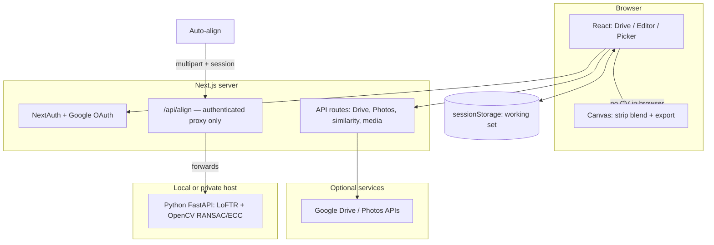

# Seasonal photo blender

Next.js app to pick images from **Google Drive** and **Google Photos (Picker)**, score them with **CLIP** in the browser (or optional **Gemini**), then **align**, **match look**, and **export** a single horizontal **strip** composite (one column per photo, same scene across seasons or times of day).

---

## Architecture



- **Client:** UI state (layer order, transforms, options) and the **working set** of image ids live in `sessionStorage` (see `src/lib/workingSet.ts`).
- **Server:** OAuth secrets and tokens stay on the host; the app does **not** run OpenCV in the browser.
- **Align service:** A **optional** **Python** sidecar (`sidecar/`) uses **Kornia LoFTR** for dense matches when `torch` + `kornia` are installed, else **SIFT+ORB**, then **RANSAC** and optional **gradient ECC**; it returns per-layer **similarity** parameters. The Next route `POST /api/align` **requires sign-in** and only **proxies** to `ALIGN_SERVICE_URL` (it never exposes your sidecar publicly without you putting it behind the same trust boundary). `GET /health` on the sidecar reports `loftr` / `loftr_enabled`.

---

## Critical user journey (CUJ)

1. **Sign in** with Google and grant read-only access where prompted (Drive, Photos Picker scope as configured).
2. **Find** images: search **Drive** folders, or use **Google Photos** picker flows; optionally **rank** candidates with a text prompt (local CLIP and/or Gemini).
3. **Add** chosen images to the **working set** and open the **Editor**.
4. **Reorder** layers (left → right columns in the final strip), **remove** a layer, or nudge **transforms** (pan / rotate / scale) for the selected column.
5. **Optional — Auto-align** (needs running sidecar + `ALIGN_SERVICE_URL`): register each non-reference image to the **leftmost** column using the pipeline below, then **Match brightness, contrast & color** to a chosen reference if desired.
6. **Download** a PNG of the strip composite.

---

## Alignment (Python sidecar)

Alignment runs **on the server** in `sidecar/main.py` so the stack stays fast in the browser. It answers: *given the same output canvas size and letterbox as the editor, what **similarity** (translation, rotation, uniform scale) maps each *other* image onto the *reference* image?*

### Geometry shared with the editor

For each file, images are **letterboxed** to the work size (width = `work_width`, height from the **reference** image’s aspect ratio): scale `r = min(outW/w, outH/h, 1)`, centered, padded with black. That matches the editor’s `drawLayerToCanvas` behavior.

The **left column** is the reference: `ref_index` defaults to `0` (form field `refIndex`), matching **first row in the list** = **left** in the strip.

### Step 1 — Correspondence points: LoFTR (default) or SIFT+ORB (fallback)

**Deep matcher (preferred):** If `SPB_USE_LOFTR` is not set to `0` and the optional `torch` / `kornia` dependencies are available (`sidecar/requirements.txt`), each pair of letterboxed grays is resized to a common long-side cap (see `LOFTR_MAX_SIDE` in `sidecar/deep_match.py`), converted to a tensor batch, and passed through **LoFTR** with **outdoor** pre-trained weights. The network outputs matched pixel coordinates in the resized frame; they are rescaled to **full** letterbox resolution, optionally filtered by **match confidence** and downsampled to a max pair count for RANSAC speed. Pairs are interpreted as **other → ref** in the same sense as OpenCV RANSAC below.

**Classic fallback (automatic):** If LoFTR is disabled, unavailable, or returns too few points, the code uses a **structure** image (CLAHE + **Sobel** gradient magnitude + **Laplacian**), then **SIFT** (Lowe **ratio** test, ≈ 0.75) on (structure, structure) and (CLAHE, CLAHE), **ORB** on structure, **merged** and **deduplicated** matches, with feature extraction on a downscaled long side (`KEYPOINT_MAX_SIDE`) and scale back to full resolution for RANSAC.

The align response includes a per-layer `matcher` field: `"loftr"`, `"sift"`, or on failure `"none"`.

### Step 2 — RANSAC similarity

- `cv2.estimateAffinePartial2D` with **RANSAC** recovers a **partial affine** 2×3 matrix **M** with **only rotation + uniform scale + translation** (four degrees of freedom), mapping **source (other) → destination (ref)** in OpenCV’s convention:  
  ` [x' y']ᵀ = [a b; c d][x y]ᵀ + [tx ty]ᵀ `  
  with `a² + c²` giving scale and `atan2(c, a)` giving rotation in the usual way.

Inliers are subject to a **reprojection threshold** (see `RANSAC_THRESH`); at least `MIN_INLIERS` inliers are required or the layer fails for that align call.

### Step 3 — Refinement (ECC) on gradient magnitudes

- Build **unit-normalized** **gradient magnitudes** for ref and other (Sobel, magnitude).
- **Mask:** the **top 12%** of the frame (sky band) is **excluded** so alignment keys off buildings/horizon.
- `cv2.findTransformECC` refines to a **6-DOF affine** in that domain; the 2×2 part is **projected to uniform scale × rotation** (see `affine_2x3_to_similarity` in the code) so the result stays a **similarity**.
- The refined matrix is **kept** only if masked **L1** error of gradient mags is **not worse** than a small margin vs. the RANSAC init (see `ECC_WORST_FACTOR`).

### Step 4 — Editor parameters (client)

The final 2×3 **M** (similarity) is converted in `decompose_to_editor` to the editor’s **`tx`, `ty`** (pixel offsets from canvas center; center-compensated for rotation/scale), **`rotDeg`**, and **`scale`**, and then **clamped** (translation limits scale with output width/height; rotation/scale have fixed bounds in code). The **reference** row gets identity. The app applies these as **2D canvas transforms** per layer (it does **not** do a full homography per strip).

**Limits:** A single **global similarity** per image cannot remove all **parallax / different focal length**; very mismatched camera geometry may still show seams at column boundaries.

---

## Strip composite and “match look” (browser)

- **Layout:** `n` columns, column `k` (0-based) takes pixels from layer `k` for  
  `x ∈ [ floor(k·W/n), floor((k+1)·W/n) )` (see `buildComposite` in `src/lib/image/renderStack.ts`).
- **Match brightness, contrast & color** (optional): for each R/G/B channel, match **global mean and standard deviation** to the **reference** layer (pick first/middle/last in order). For channel `c`, with source stats `(μ_s, σ_s)` and reference `(μ_r, σ_r)`:  
  `out_c = clamp( (in_c - μ_s) · min(σ_r / max(σ_s, s_min), g_max) + μ_r )`  
  (constants for minimum σ and max stretch in `src/lib/image/luminance.ts`). The **reference** column is a no-op on itself.

---

## Credentials and secrets

- **Never commit** real secrets. Copy **`.env.example` → `.env.local`** and fill in values. Files matching `.env*` are **gitignored** except `.env.example`.
- `AUTH_SECRET`, `GOOGLE_CLIENT_ID`, `GOOGLE_CLIENT_SECRET`, optional `GEMINI_API_KEY` live only in environment / hosting config.

---

## Local development

**Requirements:** **Node.js** 20+ and **Python** 3.10+ (sidecar: **OpenCV** and dependencies from `sidecar/requirements.txt`).

### 1) Install dependencies

```bash
npm install
cd sidecar && pip install -r requirements.txt
```

(Use a virtualenv for Python if you prefer.)

### 2) Environment

```bash
cp .env.example .env.local
# Edit .env.local: follow comments in .env.example (OAuth, optional Gemini).
# For auto-align locally, set:
# ALIGN_SERVICE_URL=http://127.0.0.1:8765
```

### 3) Run **Next.js** and the **align** sidecar together (one command)

From the **repository root**:

```bash
npm run dev:all
```

- **Next.js:** default [http://localhost:3000](http://localhost:3000) (or the port the CLI prints).
- **Align service:** [http://127.0.0.1:8765](http://127.0.0.1:8765) — health check `GET /health`, align `POST /align` (the app uses these via the authenticated proxy).

### 4) Or run the two processes separately

**Terminal A — app**

```bash
npm run dev
```

**Terminal B — sidecar (only if you use Auto-align)**

```bash
cd sidecar
python -m uvicorn main:app --host 127.0.0.1 --port 8765
```

On Windows, if `python` is not on your `PATH`, try `py -m uvicorn ...` instead of `python -m ...`.

### Build for production

```bash
npm run build
npm run start
```

Deploy the **Next** app to your host (e.g. Vercel). The **align** service should run in a **private** network or behind your auth; set `ALIGN_SERVICE_URL` in production only to a URL your server can call.

---

## More documentation

- **Sidecar (Python):** `sidecar/README.md` (e.g. Windows / NumPy notes).

## License

Private / project default unless you add a `LICENSE` file.
